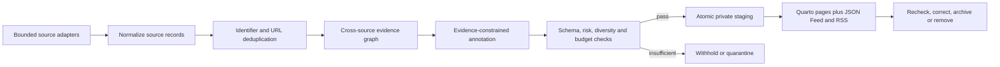

# System architecture

## Purpose and boundary

The Cities & Climate Learning Lab website is a static, accessible Quarto site backed by versioned records. Current Conversations groups timely source records into public conversation clusters. AI may help discover, classify and summarize; the original source—not a model—is the evidentiary authority. Gate 5B prepares a protected, artifact-only live benchmark but makes no paid call and performs no public deployment.

## Control plane and content plane

Code, schemas, prompts, query packs, source policy, disclosure, budgets, thresholds and workflows form the **control plane** and require reviewed pull requests. Discovered sources and generated clusters form the **content plane**. They may be unreviewed, but can publish only under deterministic controls and conspicuous disclosure.

## Canonical model

- `source_id` records bibliographic identity, URL, stable identifier, dates, organisation, environment/role, accessible evidence, discovery provenance, review and correction state.
- `cluster_id` records a discussion-level title, principal and linked sources, themes, geography, summary, relevance, limitations, clustering rationale/history and publication state.
- Principal sources follow an explicit role hierarchy. Commentary can be linked but cannot displace stronger primary research, official policy or dataset evidence without recorded rationale.
- People, projects and manually selected publications remain YAML. Complete publication reconciliation is a validated JSON inventory generated from ORCID/Crossref/publisher facts plus explicit owner overrides.

## Components

| Component | Responsibility |
|---|---|
| Quarto and generated fragments | Responsive semantic pages, archive, filters, feeds and stable moved-page links |
| Python package | Provider adapters, normalization, clustering, budgets and atomic transactions |
| JSON Schema | Source, cluster, strict Responses output, query pack and publication constraints |
| Query/source configuration | Six themes, bounded concepts, exclusions, source roles and diversity caps |
| Private staging | Complete validated snapshot: sources, clusters, feeds, site fragment, manifest and budget ledger |
| CI | Build before site-inspection tests; offline checks by default; protected manual benchmark; optional isolated automation-branch write |

## Publication transaction and safe failure

A run writes a complete candidate snapshot to a temporary sibling directory. After manifest, record, feed and site validation, it atomically replaces `staging/current-conversations/current`; the previous directory becomes last-known-good. Any exception removes only the temporary work and records a failure manifest. Normal builds never discover content or spend money.

## Deployment model

The build output is static. Discovery and benchmark jobs have repository read permission. `Current Conversations live benchmark` is manual, uses the protected `live-benchmark` environment and produces artifacts only. A separate staging job is disabled unless explicitly enabled, validates an allowed-path diff and targets only `automation/current-conversations-staging` with write permission. It cannot deploy and never targets `main`. Production deployment, hosting and DNS are later owner decisions.
