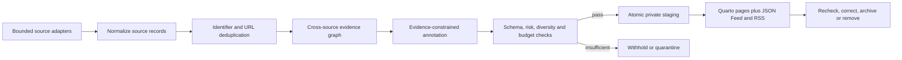

# System architecture

## Purpose and boundary

The Cities & Climate Learning Lab website is a static, accessible Quarto site backed by versioned records. Current Conversations groups timely source records into public conversation clusters. AI may help discover, classify and summarize; the original source—not a model—is the evidentiary authority. Gate 5B prepares a protected, artifact-only live benchmark but makes no paid call and performs no public deployment.

The public information architecture is driven by the four-theme registry in `config/research_scope.yml`. The generator uses that single source for the homepage learning cycle, research overview, theme landing pages, record links and feed classifications. Themes have no status: all four are current intellectual questions. Research-work records retain one primary theme and optional secondary themes while geography, method, sector and climate domain remain separate facets. Current Conversations clusters may use a null primary theme when evidence does not support classification.

## Control plane and content plane

Code, schemas, prompts, query packs, source policy, disclosure, budgets, thresholds and workflows form the **control plane** and require reviewed pull requests. Discovered sources and generated clusters form the **content plane**. They may be unreviewed, but can publish only under deterministic controls and conspicuous disclosure.

## Canonical model

- `source_id` records bibliographic identity, URL, stable identifier, dates, organisation, environment/role, accessible evidence, discovery provenance, review and correction state.
- `cluster_id` records a discussion-level title, principal and linked sources, themes, geography, summary, relevance, limitations, clustering rationale/history and publication state.
- Principal sources follow an explicit role hierarchy. Commentary can be linked but cannot displace stronger primary research, official policy or dataset evidence without recorded rationale.
- People, research work, research ideas and manually selected publications remain YAML. Complete publication reconciliation is a validated JSON inventory generated from ORCID/Crossref/publisher facts plus explicit owner overrides.

### Research content model

- A **theme** is an enduring analytical question. It does not carry ongoing/completed or maturity status.
- **Research work** is actual activity: programme, research line, project, study, paper, report, tool or dataset. It is ongoing or completed and records its relationship to CCLL.
- A **publication or output** is one canonical bibliographic record. It may link to genuine work, link directly to themes, or have no parent work record. Work never duplicates title, authors, year, identifier or publication status when those facts come from a connected publication.
- A **research idea** is a separately validated possible future question with suggested methods and a mandatory non-active/non-funded disclaimer. It cannot enter work or output counts, feeds or Current Conversations.

`scripts/generate_site.py` derives paper/report work titles from their connected canonical publication when `title: null`, produces one canonical `/work/` listing, and creates accessible `/projects/` transition pages. Theme pages aggregate ongoing work, selected completed/foundational work, separately styled research ideas, learning-cycle connections and—last—external Current Conversations. Publication examples are deduplicated when the same canonical record is already represented by connected work.

## Components

| Component | Responsibility |
|---|---|
| Quarto and generated fragments | Responsive semantic pages, archive, filters, feeds and stable moved-page links |
| Python package | Provider adapters, normalization, clustering, budgets and atomic transactions |
| JSON Schema | Source, cluster, strict Responses output, query pack and publication constraints |
| Query/source configuration | Four analytical themes, separate facets, bounded concepts, exclusions, source roles and diversity caps |
| Private staging | Complete validated snapshot: sources, clusters, feeds, site fragment, manifest and budget ledger |
| CI | Build before site-inspection tests; offline checks by default; protected manual benchmark; optional isolated automation-branch write |

## Publication transaction and safe failure

A run writes a complete candidate snapshot to a temporary sibling directory. After manifest, record, feed and site validation, it atomically replaces `staging/current-conversations/current`; the previous directory becomes last-known-good. Any exception removes only the temporary work and records a failure manifest. Normal builds never discover content or spend money.

## Deployment model

The build output is static. Discovery and benchmark jobs have repository read permission. `Current Conversations live benchmark` is manual, uses the protected `live-benchmark` environment and produces artifacts only. A separate staging job is disabled unless explicitly enabled, validates an allowed-path diff and targets only `automation/current-conversations-staging` with write permission. It cannot deploy and never targets `main`. Production deployment, hosting and DNS are later owner decisions.

Quarto cannot create server-side HTTP redirects in a static local build. The generator therefore preserves six former theme URLs and the former project routes as accessible transition pages with canonical links and direct destinations. Internal navigation and generated record links use only the four current theme routes and `/work/`.

### Draft 0.1 profiles and curation

The normal Quarto profile renders a domain-root site to `_site/`. The `project-path` profile sets `website.site-path: /CCL-Lab-Website/` and renders to `_site-project-path/CCL-Lab-Website/`. Quarto therefore rewrites navigation, generated project-root links, assets, search and transition routes for the mount without duplicate source pages or a hardcoded future domain.

Theme-page prominence is a separate editorial layer. `config/theme_featured_examples.yml` selects four to six Work or publication records per theme and stores a theme-specific contribution statement, evidence reviewed, display order and optional boundary. Canonical identity and broader theme relationships remain in Work records, `config/publication_theme_examples.yml` and the complete publication inventory.

The prepared Pages workflow is manual only. A read-only build job produces and checks the project-path artifact; a separate `public-draft` environment job alone receives `pages: write` and `id-token: write`. Missing confirmation or `PUBLIC_DRAFT_DEPLOY_ENABLED` causes the workflow to stop before build or deployment.

### Query intent, facets and classification

`config/query_packs/current-conversations-v2.yml` is the active discovery configuration. A query is explicitly a theme, facet or exploratory query. Theme queries record an intended analytical question; facet and exploratory queries keep `theme_intent: null`. Geography, sector, method, climate domain, source environment, tools, datasets and models do not force classification. Every retrieved source still undergoes content-based classification, and a null primary theme remains valid. The v1 pack is retained as superseded migration evidence rather than overwritten.
