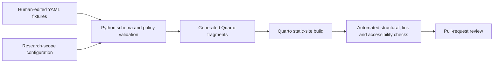
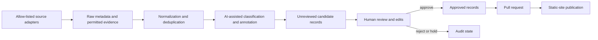

# Planned system architecture

## Purpose

The Cities & Climate Learning Lab website is a public, accessible Quarto site backed by reviewed structured records. A later Research Watch pipeline may discover and classify relevant material, but source material—not an AI system—remains the evidentiary authority.

## Gate 0–1 implementation

The repository is the system of record. YAML is used for editorial records because it is readable in code review; JSON Schema provides machine-checkable contracts. Python validates records, enforces cross-record rules, and produces deterministic listing fragments. Quarto renders those fragments into a static website.

## Planned Gate 2+ flow

Later ingestion adapters should retrieve only approved source types, preserve retrieval metadata, and save the exact evidence made available to summarisation. AI output must be treated as a proposed annotation with model and prompt provenance. It must never replace source metadata or bypass human approval.

## Components

| Component | Responsibility | Current state |
|---|---|---|
| Quarto site | Navigation, accessible pages, reviewed and candidate views | Implemented with fixtures |
| Content store | Versioned YAML records for people, projects, publications, themes and Research Watch | Implemented with examples |
| Schemas | Required fields, enumerations, dates and URI formats | Implemented |
| Python tooling | Validation, cross-record checks and listing generation | Implemented |
| CI | Tests, static build, internal links and practical accessibility checks | Implemented |
| Source adapters | Academic, institutional, news, blog, tool and Bluesky discovery | Out of scope |
| AI annotation service | Classification, summaries and relevance rationales | Out of scope |
| Review interface | Reviewer workflow beyond pull requests | Out of scope |

## Data lifecycle

1. A source is discovered and normalized into a candidate record.
2. The source URL, stable identifier, publication date, retrieval date, evidence basis, and AI provenance are preserved.
3. Validation runs before a candidate is proposed in a pull request.
4. The public candidate area labels the record as automated and unreviewed. Fixture records in Gate 1 are additionally labelled as demonstrations.
5. A human reviewer checks the source, edits the annotation, resolves risk flags, and records a decision.
6. Only an approved record may appear as a lab-reviewed selection.
7. Corrections and removals update status fields and retain the record history in version control.

## Trust boundaries

External content is untrusted. Future adapters must separate retrieved text from system instructions, use allow-lists and timeouts, and avoid executing or rendering arbitrary HTML. Secrets belong in protected runtime secret stores. The built site contains public, reviewed data only; it does not need runtime credentials.

## Deployment model

The intended production artifact is a static site built by a scheduled or pull-request GitHub workflow and deployed only after tests and review pass. Production hosting, DNS, analytics, and deployment credentials are intentionally not configured in Gate 0–1.
