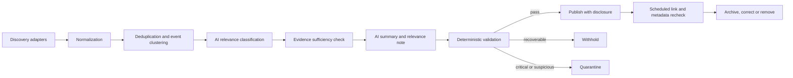

# System architecture

## Purpose

The Cities & Climate Learning Lab website is a public, accessible Quarto site backed by versioned structured records. Research Watch may publish automatically generated, normally unreviewed records, but the source—not the model—is always the evidentiary authority.

## Control plane and content plane

Code, schemas, prompts, query packs, source policy, disclosure wording, thresholds, governance and security controls form the **control plane**. They require human-reviewed pull requests.

Automatically discovered Research Watch records form the **content plane**. They may publish without item-level human review when all machine-enforced controls pass. The separation prevents source content or a model from changing the rules governing publication.

## Lifecycle

Human review may be recorded at any later point but is not in the required path.

## Components

| Component | Responsibility |
|---|---|
| Quarto site | Accessible pages, theme cross-listings, unified Research Watch and public disclosures |
| Canonical YAML store | One record per person, project, publication or Research Watch item |
| Controlled vocabularies | Small extensible lists for themes, geography, governance scale, methods, domains, sectors and source types |
| JSON Schemas | Required provenance, relationship, processing and publication fields |
| Source adapters | Provider-independent OpenAlex, Crossref, OpenAI web-search, Bluesky and captured-fixture discovery |
| Processing pipeline | Normalization, stable-key generation, deduplication, event clustering, classification and publication controls |
| Evaluation | Benchmarks and run metrics for coverage, provenance, failures, diversity and duplication |
| Run manifests | Inputs, versions, adapter results, errors, counts, model usage and output artefacts |
| CI/workflows | Network-independent tests plus bounded manual/scheduled discovery and static packaging |

## Canonical relationship model

Projects and publications are stored once. Each has one primary theme and up to three secondary themes, plus separate geographies, methods, climate domains and sectors. Generated theme views point to the same canonical record. Unfiltered lists deduplicate by record ID.

Research Watch records have one scored primary theme and up to two scored secondary themes. Geography is separate and cannot create thematic relevance by itself.

## Publication transaction

A discovery run writes to a temporary staging area. Only after normalization, classification, publication checks, schema validation, listing tests and a full site build succeed are passing records copied into the publishable store. A failed or partial run retains the previous public store unchanged. Run reports and withheld/quarantined audit records are written separately.

## Trust boundaries

Retrieved metadata, HTML, documents, snippets and posts are untrusted data. Adapters have bounded network access and no publication credentials. The classifier receives only recorded evidence, cannot execute actions and cannot change repository policy. Site generation escapes public fields and renders no arbitrary source HTML.

## Deployment model

The output is a static site. Gate 2–3A creates production-ready packages but does not deploy them. A later authorized workflow may publish the last validated artifact from an automation branch or equivalent auditable mechanism.
# Gate 3B–4A implementation note

The private Research Watch control flow is now discovery → normalization → identifier deduplication → conservative event clustering → evidence sufficiency → deterministic publication and diversity controls → temporary staging → validation → atomic last-known-good replacement. Normal website builds never invoke network discovery. Private staged records, withheld records and run manifests remain separate from curated public YAML.
